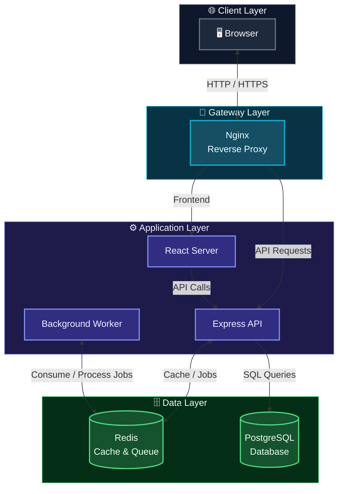

# Architecture

```mermaid
flowchart TB
    %% Client Layer
    subgraph CLIENT["🌐 Client Layer"]
        Browser["🖥️ Browser"]
    end

    %% Gateway Layer
    subgraph GATEWAY["🚪 Gateway Layer"]
        Nginx["Nginx<br/>Reverse Proxy"]
    end

    %% Application Layer
    subgraph APPLICATION["⚙️ Application Layer"]
        React["React Server"]
        Express["Express API"]
        Worker["Background Worker"]
    end

    %% Data Layer
    subgraph DATA["🗄️ Data Layer"]
        Redis[("Redis<br/>Cache & Queue")]
        Postgres[("PostgreSQL<br/>Database")]
    end

    %% Communication
    Browser <-->|HTTP / HTTPS| Nginx
    Nginx -->|Frontend| React
    Nginx -->|API Requests| Express
    React -->|API Calls| Express

    Express <-->|Cache / Jobs| Redis
    Express -->|SQL Queries| Postgres
    Worker <-->|Consume / Process Jobs| Redis

    %% Styling
    classDef client fill:#1e293b,stroke:#64748b,color:#f8fafc,stroke-width:2px
    classDef gateway fill:#164e63,stroke:#06b6d4,color:#ecfeff,stroke-width:2px
    classDef application fill:#312e81,stroke:#818cf8,color:#eef2ff,stroke-width:2px
    classDef data fill:#14532d,stroke:#4ade80,color:#f0fdf4,stroke-width:2px

    class Browser client
    class Nginx gateway
    class React,Express,Worker application
    class Redis,Postgres data

    %% Subgraph Styling
    style CLIENT fill:#0f172a,stroke:#64748b,stroke-width:1px,color:#f8fafc
    style GATEWAY fill:#083344,stroke:#06b6d4,stroke-width:1px,color:#ecfeff
    style APPLICATION fill:#1e1b4b,stroke:#818cf8,stroke-width:1px,color:#eef2ff
    style DATA fill:#052e16,stroke:#4ade80,stroke-width:1px,color:#f0fdf4
```